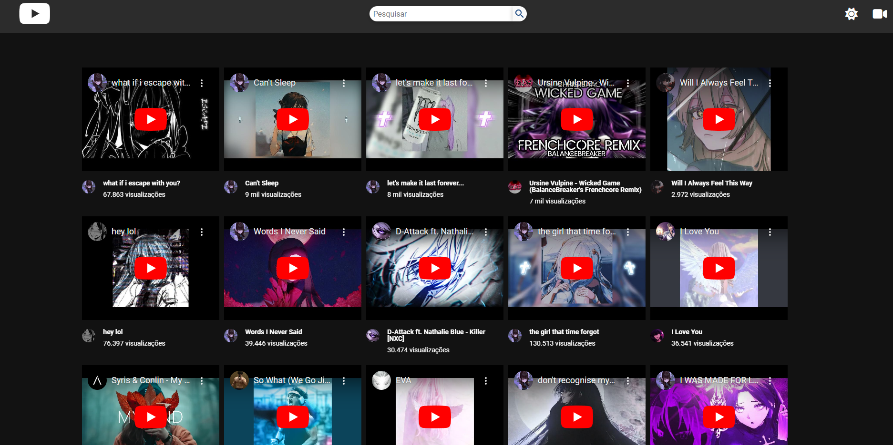
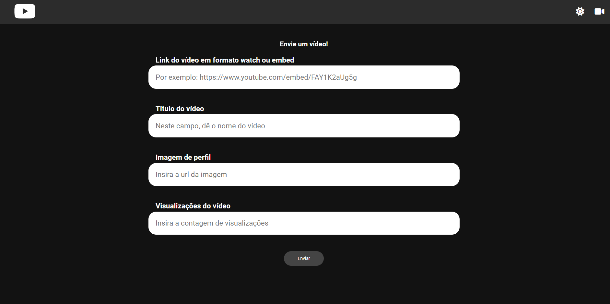

# Youtube Remake ▶️

Projeto "Youtube Remake" trabalhando com JSON Server.


## Screenshots




## Ferramentas utilizadas

- HTML
- CSS
- JavaScript
- JSON Server
- Font Awesome


## Funcionalidades
- Utilização de um arquivo .json juntamente com json-server para simular uma API;
- Ferramenta para o upload de um novo vídeo para o banco de dados;
- Dark Mode persistente em todas as páginas com a utilização de localStorage.


## Documentação do JSON Server

#### Instalação do JSON Server

```http
  npm install -g json-server
```

#### Crie um arquivo .json com algumas informações

```http
 {
  "posts": [
    { "id": 1, "title": "json-server", "author": "typicode" }
  ],
  "comments": [
    { "id": 1, "body": "some comment", "postId": 1 }
  ],
  "profile": { "name": "typicode" }
}
```

#### Inicie o JSON Server
```http
  json-server --watch db.json ou npx json-server --watch db.json
```


[Veja a documentação completa](https://github.com/typicode/json-server)


## Feito por:

Lucas Kenji (dinozindev).

